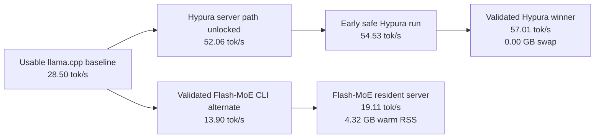
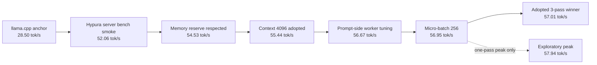
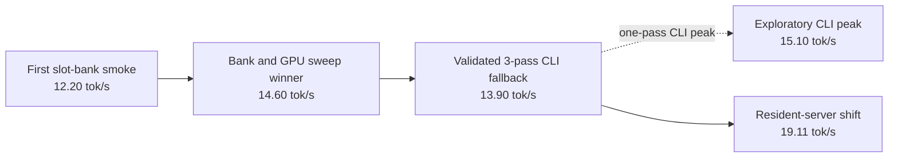

# Gemma 4 on a 24 GB M4 Pro

[](https://github.com/scasella/gemma4-m4-pro/actions/workflows/release-readiness.yml)


This repo started as a local bring-up effort for running `gemma-4-26B-A4B-it` on a 24 GB M4 Pro MacBook Pro. The main result is two validated winners from that research: a tuned Hypura path for raw speed and a resident Flash-MoE path for lower memory pressure.

This public repo keeps the research outcome, the curated measurements, and the front-door commands without bundling the local-only model files and sidecars from the private workspace.

## Performance at a glance

All numbers below were measured during the original 24 GB M4 Pro research runs with the local `gemma-4-26B-A4B-it-Q4_K_M.gguf` file.

| Runtime | How it is used | Generation speed | Prompt speed | First answer | Load time | Lowest free memory | Swap growth | Warm resident memory |
| --- | --- | ---: | ---: | ---: | ---: | ---: | ---: | ---: |
| Hypura | tuned resident server | 57.01 tok/s | 67.44 tok/s | 1025.7 ms | 1.97 s | 9.33 GB | 0.00 GB | about 12.51 GB |
| Flash-MoE | one-shot CLI fallback | 13.90 tok/s | 10.90 tok/s | 71.9 ms | 18.69 s | 8.81 GB | 0.00 GB | n/a |
| Flash-MoE | resident server | 19.11 tok/s | 22.36 tok/s | 3048.2 ms | 9.19 s | 10.70 GB | 0.00 GB | about 4.32 GB |

## What improved during the research

The charts below separate adopted winners from exploratory-only spikes. The fast Hypura path has one one-pass peak above the adopted winner, but the saved export stays on the three-pass validated result because the follow-up reruns were less stable.

### Overall frontier



### Hypura optimization ladder



| Hypura step | What changed | Result | Why it mattered |
| --- | --- | ---: | --- |
| Usable anchor | Started from the first working `llama.cpp` baseline on this laptop. | 28.50 tok/s | Set the “beat this” line for every later optimization. |
| Hypura server path | Moved the fast path onto Hypura’s resident server flow. | 52.06 tok/s | Unlocked the big jump in throughput immediately. |
| Memory reserve | Made Hypura respect real headroom instead of assuming the whole machine was free. | 54.53 tok/s | Improved speed without giving up the comfort margin. |
| Context 4096 | Raised context from the earlier strict setup to `4096`. | 55.44 tok/s | Kept the faster path practical for real prompts. |
| Prompt tuning | Settled on the stronger prompt-side worker count. | 56.67 tok/s | This was a larger gain than just chasing main thread count. |
| Micro-batch tuning | Landed on `ubatch 256` inside the stronger combo. | 56.95 tok/s | Preserved speed while staying inside the memory rules. |
| Adopted winner | Locked the three-pass stable export at `threads 10`, `threads_batch 14`, `batch 512`, `ubatch 256`. | 57.01 tok/s | This is the official saved winner because it repeated cleanly. |

The exploratory `threads_batch=13` probe reached `57.94 tok/s`, about `1.6%` above the adopted winner, but it did not become the exported best because the repeat and current-state reruns were inconsistent.

### Flash-MoE optimization ladder



| Flash-MoE step | What changed | Result | Why it mattered |
| --- | --- | ---: | --- |
| First smoke run | Proved the Gemma 4 Flash-MoE branch could answer correctly here at all. | 12.20 tok/s | Turned the low-memory path from an idea into a measurable backend. |
| Bank and GPU sweep | The best one-pass sweep favored slot-bank `16` with the dense and shared path left on the CPU. | 14.60 tok/s | Showed that CPU dense/shared was the right direction on this Mac. |
| Validated CLI fallback | Locked the three-pass one-shot fallback. | 13.90 tok/s | Gave the project a repeatable lower-pressure alternate. |
| Resident-server shift | Kept Flash-MoE hot instead of paying full startup every prompt. | 19.11 tok/s | This was the change that made Flash-MoE practically useful day to day. |

The resident-server shift improved the low-memory path from `13.90` to `19.11` tok/s, about a `37.5%` gain, while also raising the measured free-memory floor from `8.81 GB` to `10.70 GB`.

The raw numbers behind these charts are summarized in [`autoresearch/results/readme_research_summary.json`](./autoresearch/results/readme_research_summary.json). For the full side-by-side runtime write-up, start with [`autoresearch/results/runtime_comparison.md`](./autoresearch/results/runtime_comparison.md).

## Why this implementation beats the others

These comparisons are all from the saved measurements on this exact 24 GB M4 Pro setup.

| Comparison | Measured advantage | Why it wins |
| --- | --- | --- |
| Tuned Hypura vs usable `llama.cpp` baseline | `2.00x` generation speed, `16.38x` faster load, `+5.18 GB` more free memory, and `0.70 GB` less swap growth | The final fast path is not just quicker. It is also much safer to leave running on this laptop. |
| Tuned Hypura vs validated Flash-MoE CLI | `4.10x` generation speed, `6.19x` prompt speed, and `9.48x` faster load | Hypura is the right default when raw speed matters most. |
| Flash-MoE resident vs Flash-MoE CLI | `1.37x` generation speed, `2.05x` prompt speed, `2.03x` faster load, and `+1.89 GB` more free memory | The resident-server design is why Flash-MoE became a practical low-memory alternate instead of just a one-shot fallback. |
| Hypura resident vs Flash-MoE resident | `2.98x` generation speed and `3.02x` prompt speed for Hypura, but Flash-MoE uses only about `4.32 GB` warm RSS versus Hypura’s `12.51 GB` | The project beats single-path setups because it keeps both winners: one for speed and one for memory pressure. |

That is the real advantage of this implementation over the other paths in the repo. It does not force one compromise. The front-door commands can use the fastest validated runtime when the machine has room, and they can fall back to the lighter resident-server path when keeping memory free matters more.

## Where to start

If you want to use the model:

- everyday prompt and chat commands: [`autoresearch/README.md`](./autoresearch/README.md)
- tuned Hypura server path: [`hypura-main/GEMMA4_M4_PRO.md`](./hypura-main/GEMMA4_M4_PRO.md)

If you want to understand the research state:

- main benchmark and workflow docs: [`autoresearch/README.md`](./autoresearch/README.md)
- agent workflow notes: [`autoresearch/program.md`](./autoresearch/program.md)
- README chart data: [`autoresearch/results/readme_research_summary.json`](./autoresearch/results/readme_research_summary.json)
- curated runtime comparison: [`autoresearch/results/runtime_comparison.md`](./autoresearch/results/runtime_comparison.md)
- curated results manifest: [`autoresearch/results/curated_results_manifest.json`](./autoresearch/results/curated_results_manifest.json)
- lean layout manifest: [`lean_repo_layout_manifest.json`](./lean_repo_layout_manifest.json)

If you want to prepare a release or update this public repo:

- full release and update guide: [`PUBLIC_REPO_GUIDE.md`](./PUBLIC_REPO_GUIDE.md)
- release checklist: [`RELEASE_CHECKLIST.md`](./RELEASE_CHECKLIST.md)
- external runtime and model setup: [`SETUP_EXTERNALS.md`](./SETUP_EXTERNALS.md)
- one-command status and next-step guide: `./publish_status.sh`

## How This Repo Is Organized

- [`autoresearch/`](./autoresearch): the main benchmark loop, user-facing prompt/chat commands, status tools, regression smoke tests, and release preflight
- [`hypura-main/`](./hypura-main): the tuned fast runtime path and its launcher/docs
- `anemll-flash-llama.cpp-gemma4/`: optional external checkout for the lower-memory Flash-MoE path
- [`models/`](./models): local model files used by the runtime and benchmark tools
- [`autoresearch/results/runtime_comparison.md`](./autoresearch/results/runtime_comparison.md): curated benchmark summary
- [`autoresearch/results/curated_results_manifest.json`](./autoresearch/results/curated_results_manifest.json): exact saved result files intentionally kept in the lean public repo
- [`lean_repo_layout_manifest.json`](./lean_repo_layout_manifest.json): expected high-level public file layout for this lean release repo
- [`RELEASE_CHECKLIST.md`](./RELEASE_CHECKLIST.md): human release checklist

If you are just trying to use the model, start in [`autoresearch/`](./autoresearch).
If you are trying to understand how the fast runtime was tuned, also read [`hypura-main/GEMMA4_M4_PRO.md`](./hypura-main/GEMMA4_M4_PRO.md).

## Quick commands

One prompt from the project root:

```bash
./try_gemma4.sh "Tell me a short sentence about Paris."
```

Interactive chat from the project root:

```bash
./chat_gemma4.sh
```

Those wrappers default to the same automatic runtime choice as the lower-level `autoresearch` commands, so they pick the fast path when the machine has room and the lighter path when memory is tighter.

One prompt, automatic runtime choice:

```bash
cd autoresearch
./gemma4_answer.sh --mode auto "Tell me a short sentence about Paris."
```

Interactive chat:

```bash
cd autoresearch
python3 gemma4_chat.py --mode auto
```

Release preflight:

```bash
cd autoresearch
python3 release_readiness_check.py
```

## Current status

Two runtime styles are available:

- fastest overall: Hypura
- lower-memory alternate: Flash-MoE

The benchmark and status tooling for those live under [`autoresearch/`](./autoresearch).

## Lean public repo note

This GitHub release repo is intentionally lean.

It includes:

- the tuned Hypura source tree used by the fast path
- the benchmark and control scripts
- curated benchmark summaries and the small set of run artifacts needed to support them

It does **not** include:

- local model files
- the huge Flash-MoE sidecar data
- the full raw run-log archive
- the optional Flash-MoE source checkout

If you want the lower-memory Flash-MoE path in this lean repo, follow [`SETUP_EXTERNALS.md`](./SETUP_EXTERNALS.md) and clone the optional runtime into the expected local path.
